# Hi there, I'm Vineeth 👋

### 🚀 About Me

- 🎓 MCA graduate focused on **Linux administration, cloud infrastructure and DevOps automation**
- 🖥️ Managed **RHEL 9/10 and Ubuntu** servers for 50+ users with 99%+ uptime (firewalld, SELinux, SSL and DNS troubleshooting)
- ☁️ Building on **AWS** (VPC, EC2, Lambda, ALB, Auto Scaling) with **Ansible, Terraform and GitHub Actions**
- 🌱 Preparing for **AWS Certified Solutions Architect – Associate**
- 💬 Ask me about Linux servers, Ansible playbooks, AWS networking and Django backends

### 🛠️ Tech Stack

**Cloud & Infrastructure as Code** 
   

**Containers** 
   

**CI/CD & Monitoring** 
     

**Linux & Web Servers** 
    

**Development & Databases** 
        

### 📊 Dynamic Stats

### 📌 Featured Projects

| Project | What it does | Tech |
|---|---|---|
| [**AWS Resource Governance**](https://github.com/YOUR_USERNAME/aws-resource-governance) | Event-driven Lambda that detects new EBS volumes and converts GP2 to GP3 (up to 20% cost saving) | Python, Lambda, CloudWatch Events |
| [**Ansible EC2 Website Deployment**](https://github.com/YOUR_USERNAME/ansible-ec2-website) | Zero-touch Apache deployment from one playbook, multi-environment with Jinja2 | Ansible, EC2, Apache |
| [**AWS Production-Style VPC**](https://github.com/YOUR_USERNAME/aws-vpc-infrastructure) | Public/private subnets over 2 AZs with ALB, Auto Scaling, NAT and Bastion Host | VPC, ALB, ASG, S3 Endpoint |
| [**Galaxy Image Classification**](https://github.com/YOUR_USERNAME/galaxy-classification-cnn) | LeNet-5 CNN with 92% accuracy, served through a Flask API | TensorFlow, Keras, Flask |
| [**Cargonex**](https://github.com/YOUR_USERNAME/cargonex) | Multi-vendor e-commerce platform with Razorpay payments and shipment tracking | Django, REST API, MySQL |

### 🐍 Contribution Snake

